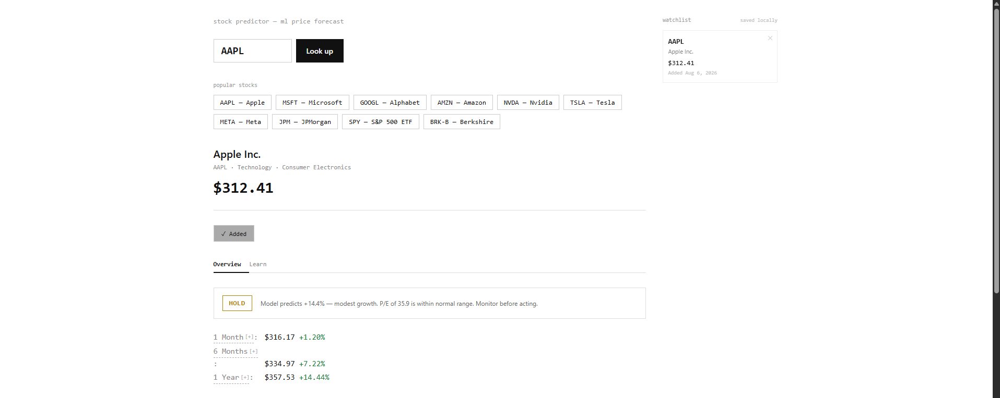

# Stock Predictor

[](https://github.com/jaysonnii/stockPredictor/actions/workflows/python-ci.yml)

[Live Demo](https://stockpredictor-nwgu.onrender.com) · [API Documentation](https://stockpredictor-nwgu.onrender.com/docs)

## Live Preview

[](https://stockpredictor-nwgu.onrender.com)

Click the preview to open the live application.

A machine-learning stock forecasting application built with Python, FastAPI, scikit-learn, yfinance, and a browser-based frontend.

The application downloads historical market data, engineers technical indicators, trains a Random Forest regression model, and generates estimated future stock prices and returns.

> This project is educational and should not be considered financial advice.

## Features

- Search stocks by ticker symbol
- View current stock information
- Display historical price data
- Generate 1-month, 6-month, and 1-year forecasts
- Train machine-learning models for selected tickers
- Calculate expected returns
- Compare the Random Forest against a naive no-change baseline
- Track stocks using a locally saved watchlist
- Access interactive FastAPI documentation
- Automatically save trained models for later use
- Run automated tests through GitHub Actions

## Technology Stack

### Backend

- Python
- FastAPI
- Uvicorn
- Pydantic

### Machine Learning and Data

- scikit-learn
- Random Forest Regression
- pandas
- NumPy
- yfinance
- joblib

### Frontend

- HTML
- CSS
- JavaScript

### Testing and CI

- pytest
- FastAPI TestClient
- GitHub Actions

## How It Works

1. The application downloads historical stock data through yfinance.
2. It creates technical indicators and lag-based features.
3. It creates a target based on the future percentage return.
4. The data is divided chronologically into training and testing sets.
5. A purge gap is placed between training and testing data to reduce target leakage.
6. A Random Forest regression model is trained.
7. The model is evaluated against a naive no-change baseline.
8. The trained model and scaler are saved locally.
9. The latest market data is processed and passed into the model.
10. The predicted return is converted into an estimated future price.

## Model Features

The model uses:

- Closing price
- Trading volume
- 20-day moving average
- 50-day moving average
- 200-day moving average
- Price relative to moving averages
- Daily returns
- 20-day volatility
- Relative Strength Index
- MACD
- MACD signal
- Historical lag prices
- Volume change

## Project Structure

```text
stockPredictor/
├── .github/
│   └── workflows/
│       └── python-ci.yml
├── static/
│   └── index.html
├── tests/
│   ├── test_api.py
│   ├── test_data.py
│   └── test_model.py
├── data.py
├── main.py
├── model.py
├── requirements.txt
├── requirements-dev.txt
└── README.md
```

The `models/` directory is generated locally when models are trained and is excluded from Git.

## Installation

### 1. Clone the repository

```bash
git clone https://github.com/jaysonnii/stockPredictor.git
cd stockPredictor
```

### 2. Create a virtual environment

Windows PowerShell:

```powershell
py -3.11 -m venv .venv
.\.venv\Scripts\Activate.ps1
```

### 3. Install application dependencies

```powershell
python -m pip install --upgrade pip
pip install -r requirements.txt
```

For development and testing:

```powershell
pip install -r requirements-dev.txt
```

## Run the Application

```powershell
python -m uvicorn main:app --reload
```

Open the application:

```text
http://127.0.0.1:8000
```

Open the interactive API documentation:

```text
http://127.0.0.1:8000/docs
```

## Testing

The project includes automated pytest coverage for:

- API health and homepage responses
- Request validation and error handling
- Prediction response schemas
- Training and baseline evaluation metrics
- Chronological purge-gap behavior
- Feature-column consistency
- Moving averages, lag features, and target generation
- RSI calculation
- Missing-value handling
- Protection against accidental input mutation

Tests use synthetic or mocked data and do not require live Yahoo Finance requests.

Run the test suite locally:

```powershell
python -m pytest -q
```

Tests run automatically through GitHub Actions on every push and pull request to `main`.

## API Endpoints

| Method | Endpoint | Description |
|---|---|---|
| GET | `/` | Opens the web application |
| GET | `/health` | Returns the API health status |
| GET | `/predict/all?ticker=AAPL` | Returns multiple forecast horizons |
| GET | `/predict?ticker=AAPL&days=252` | Returns a prediction for a selected horizon |
| POST | `/train?ticker=AAPL` | Trains or retrains a model |
| GET | `/history?ticker=AAPL&period=1y` | Returns historical closing prices |
| GET | `/info?ticker=AAPL` | Returns general company and stock information |
| GET | `/docs` | Opens the FastAPI documentation |

## Example Tickers

```text
AAPL
MSFT
GOOGL
AMZN
NVDA
TSLA
META
JPM
SPY
BRK-B
```

The first prediction for a ticker may take longer because the application must download historical data and train a model.

## Model Evaluation

The Random Forest is evaluated against a naive no-change baseline.

The baseline always predicts a future return of 0%, meaning that the future price will be unchanged from the current price. Both models are evaluated on the same held-out chronological test set.

Because the target represents the return 252 trading days into the future, the evaluation uses a 252-observation purge gap between the training and testing sets. This reduces leakage caused by training labels that use prices from the test period.

### Baseline Comparison

**Evaluation date:** August 2026  
**Prediction horizon:** 252 trading days  
**Historical data period:** Approximately 10 years

| Ticker | Model | MAE, return percentage points | RMSE, return percentage points | Directional accuracy |
|---|---|---:|---:|---:|
| AAPL | Random Forest | 17.75 | 21.21 | 77.24% |
| AAPL | Naive no-change baseline | 21.70 | 26.75 | 8.72% |

The Random Forest reduced MAE by **18.21%** and RMSE by **20.72%** compared with the naive no-change baseline. It achieved **77.24%** directional accuracy, compared with **8.72%** for the baseline.

The evaluation used:

- 1,397 training observations
- A 252-observation purge gap
- 413 held-out test observations

### Interpretation

A model should not be considered useful merely because its error values appear small. Stock-return observations are autocorrelated, and overlapping future-return targets can produce misleading evaluation results.

The baseline comparison answers a more meaningful question: does the Random Forest outperform the simple assumption that the stock will not change?

Positive MAE and RMSE improvement percentages indicate that the Random Forest outperformed the baseline. Negative improvement percentages indicate that the baseline performed better.

These results describe performance for one ticker and one historical held-out period. They do not prove that the model will generalize to future market conditions.

## Limitations

- Stock prices are influenced by events that historical price data cannot fully predict.
- Predictions are estimates and may be inaccurate.
- Shorter forecast horizons are derived from the one-year trend rather than independently trained models.
- The model does not include news, financial statements, economic indicators, or sentiment data.
- Render’s filesystem may not preserve trained models after restarts or redeployments.
- The watchlist is saved in the browser’s local storage.
- Evaluation results currently represent one ticker and one held-out period.

## Future Improvements

- Add walk-forward time-series evaluation
- Evaluate the model across multiple tickers and market conditions
- Add additional baseline and machine-learning models
- Compare feature importance across trained models
- Add financial statement and economic indicator features
- Add news and sentiment analysis
- Add user accounts and cloud-based watchlists
- Store trained models in persistent cloud storage
- Add Docker support

## Disclaimer

This application was created for educational and portfolio purposes. Its predictions should not be treated as financial advice or used as the sole basis for investment decisions.

## Author

**Jay Soni**

- GitHub: [jaysonnii](https://github.com/jaysonnii)
- LinkedIn: [Jay Soni](https://www.linkedin.com/in/jayy-soni/)